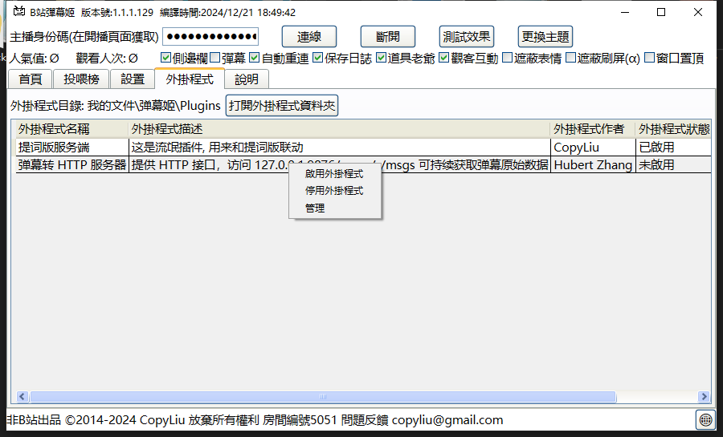
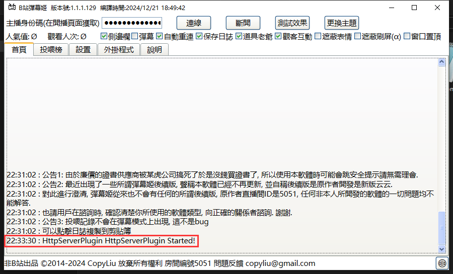

# DST Danmu

## 建立转发

### 使用[B站弹幕姬](https://www.danmuji.org/)插件

如果你使用的是 [B站弹幕姬](https://www.danmuji.org/)，可使用弹幕姬插件来开启转发。

请在 Release 页面下载 弹幕姬插件.zip，解压出 blive-dm-http.dll 后，将其放入 弹幕姬 的插件列表，右键启用即可

启用插件后，弹幕姬会有如下日志打印即为成功

如果你使用的是 linux 或 macos，或不使用 B站弹幕姬，则可以注册 B站开放平台 项目的开发者账号，使用本repo中提供的转发程序，详情见[这里](doc/main.md)

## 在饥荒中启动弹幕机模组

这一步是从本地的插件/程序中持续将弹幕转发到游戏的对话记录中

饥荒联机版插件地址 https://steamcommunity.com/sharedfiles/filedetails/?id=3216736582

## 原理&说明

饥荒本体没有给模组暴露过 WebSocket 协议接口，因此无法直接和 B站开放平台 进行通信。需要在本地有 http 服务将弹幕提供给饥荒内的模组。
