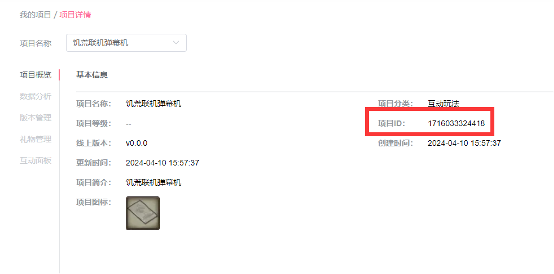
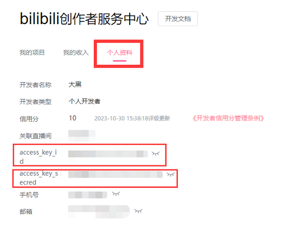
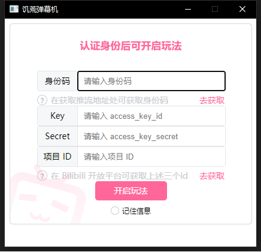
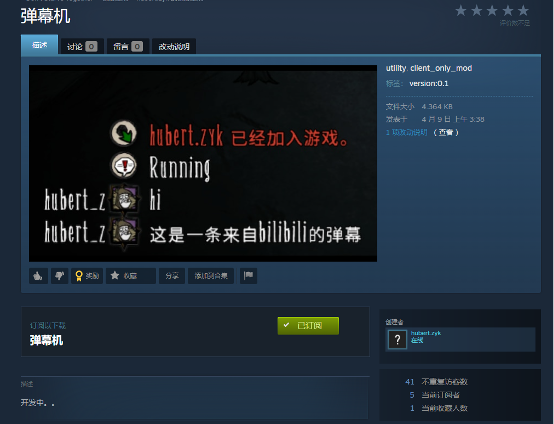
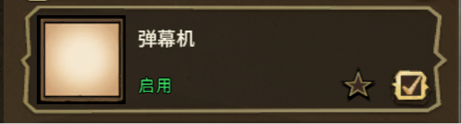
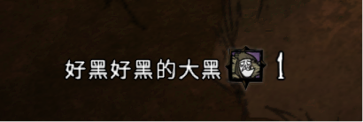

# 弹幕机使用指南
该指南为饥荒联机版开发中mod《弹幕机》撰写。由于该mod需要额外创建开平项目，进行配置等，难度较高，特写此指南方便使用。

源码位于 [DST-DM](https://github.com/HubertZhang/dst-dm)

请根据自己的操作系统及架构选择对应的程序

## 功能介绍，准备
目前弹幕机已实现的功能是为拥有b站开放平台项目的用户提供b站直播间弹幕转饥荒联机版游戏内玩家聊天的功能。弹幕机分为go端和lua端，go端需要下载dmj.exe，lua端直接在创意工坊订阅并启用即可。

## 开放平台注册
由于目前应用未上架开放平台，只有拥有b站开放平台项目的用户可以正常使用，以下是开放平台项目注册指导。

1. 登录b站开放平台注册页面https://open-live.bilibili.com/open-manage，界面应如下图所示：

    
2. 点击左侧个人开发者认证按钮进行认证。认证完毕后应可以进入如下界面：

    
3. 点击右侧创建项目随意创建一个项目，因为我们并不需要实际有项目内容，只是需要项目的appid，因此内容随意填写即可。

    
4. 项目创建完毕后即会有项目页面，记录项目id备用。

    
5. 之后回到我的项目页面，点击页面上方的“个人资料”分栏，记下access_key_id和access_key_secred备用。

    

## 启动本地弹幕转发服务器
本项目对弹幕的转发通过 golang 端实现。下载dmj.exe后，将其置入任意文件夹，双击打开。

在打开后的窗口中输入身份码（直播推流页面获取），Key，Secret和项目ID（b站开平获取），可以点击“去获取”前往对应页面。

完成后点击开启玩法，看到如图界面即成功。

## 游戏启用弹幕功能
订阅并启用mod，在游戏内通过本地命令行启用弹幕功能：

在[Steam创意工坊](https://steamcommunity.com/sharedfiles/filedetails/?id=3216736582)中订阅弹幕机mod

并在游戏中启用（该mod为客户端mod）。

    
即可连接到弹幕服务器

 
## 注意事项：
1. 注册开平项目可能需要审核，工作日大概1~2天，周末，节假日好像不上班。
2. 建议先开启dmj.exe，再进入存档，否则需要进入存档后在控制台中输入DMJ_Start()手动启用弹幕机功能。
